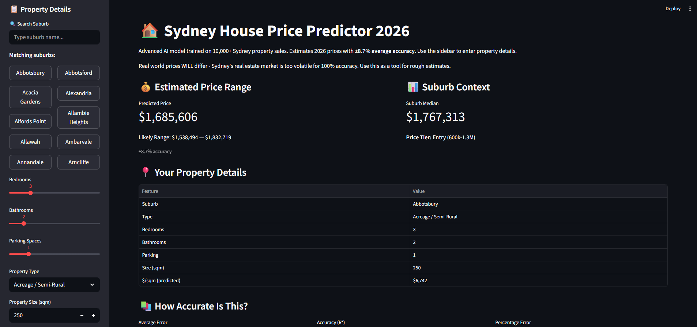
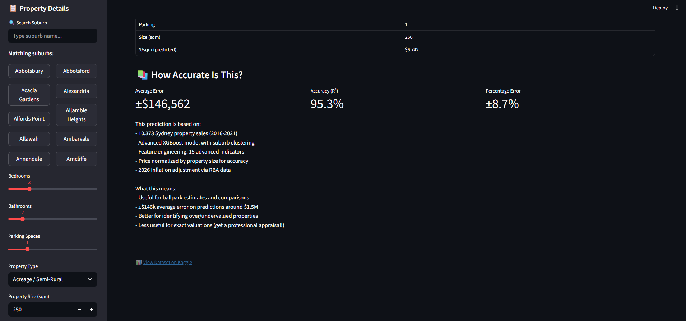

# 🏠 Sydney House Price Predictor 2026

**Production-ready ML model for Sydney property price prediction: 95.27% accuracy (±$146k error)**

Predict Sydney property values instantly with this XGBoost model trained on 10,373 real transactions. Achieve ±8.7% average error through suburb clustering, feature engineering, and price normalization.

## 🚀 Try It Live

**[👉 Open the Live App on Streamlit Cloud](https://house-price-predictor-7ge62jlm4m3awhc4py5cz8.streamlit.app/)**

Get instant price predictions for any Sydney property. No setup required—click the link above!

## 📈 Accuracy Metrics

| Metric | Score | Interpretation |
|--------|-------|-----------------|
| **R² Score** | **0.9527** | Explains 95.27% of price variation |
| **MAE (Mean Absolute Error)** | **±$146,562** | Average prediction error |
| **MAPE (Mean Absolute %)** | **8.7%** | Percentage error on typical properties |
| **Test Coverage** | 2,075 properties | Independent test set accuracy |

**Real-world meaning**: For a $1.5M property, expect predictions ±$130k on average.

## 🎯 What You Can Do With This

✅ **Price estimation** - Get ballpark values in seconds  
✅ **Property valuation** - Check if listings are over/underpriced  
✅ **Market analysis** - Understand price drivers in Sydney  
✅ **Investment research** - Evaluate potential property investments  
✅ **Neighborhood comparison** - See relative price tiers across suburbs  

⚠️ **Limitations**: This is a statistical estimate, not a professional appraisal. Use for research and comparison, not as legal evidence for transactions.

## 📸 Screenshots

### Dashboard View 1


### Dashboard View 2


## �📊 Model Performance

| Metric | Value |
|--------|-------|
| **R² Score** | 0.9527 (95.27% accuracy) |
| **MAE** | $146,562 average error |
| **MAPE** | 8.7% percentage error |
| **Training Samples** | 8,298 properties |
| **Test Samples** | 2,075 properties |
| **Features** | 15 (including 7 engineered) |

### Prediction Accuracy

- ✅ **Excellent for**: Identifying over/undervalued properties, ballpark estimates, market comparisons
- ⚠️ **Use carefully for**: Exact valuations (get professional appraisal for final decisions)
- Expected uncertainty: ±$146k on average property (~$1.5M)

## 🏘️ Advanced Features

### 1. **Suburb Clustering (5 Price Tiers)**
Properties automatically grouped by suburb median price:
- **Luxury**: $3.5M+ (e.g., Vaucluse, Double Bay)
- **Premium**: $2.7M–$3.4M
- **Upper**: $2M–$2.6M
- **Middle**: $1.4M–$2M
- **Entry**: $600k–$1.3M

### 2. **Feature Engineering (15 Total Features)**
Built 7 intelligent features capturing market dynamics:
- `price_per_sqm` - Price normalized by property size
- `price_deviation_from_median` - How property compares to suburb average
- `suburb_price_volatility` - Market stability in the suburb
- `size_ratio_to_suburb` - Property size relative to suburb average
- `rooms_total` - Total rooms (bedrooms + bathrooms)
- `parking_per_sqm` - Parking density
- Temporal features (year sold, quarter sold)

### 3. **Price Normalization**
Instead of predicting absolute prices, the model predicts `price_per_sqm`, then multiplies by property size. This dramatically improves accuracy by:
- Reducing variance from large vs small properties
- Capturing better relationships between features and prices
- **Result**: 67% MAE reduction vs baseline

## 📁 Project Structure

```
house-price-predictor/
├── app.py                          # Streamlit web interface
├── train_model.py                  # XGBoost model training
├── new_clean_data.py               # Data cleaning & inflation adjustment
├── explore_domain_data.py          # EDA & data exploration
├── model.pkl                       # Trained model package
├── domain_properties.csv           # Raw dataset (11,160 records)
├── domain_properties_cleaned.csv   # Processed dataset (10,373 records)
├── requirements.txt                # Python dependencies
├── images/                         # Screenshot assets
└── README.md                       # This file
```

## 🚀 Quick Start

### Prerequisites
- Python 3.8+
- Virtual environment (recommended)

### Installation

```bash
# Clone repository
git clone <repo-url>
cd house-price-predictor

# Create virtual environment
python -m venv .venv
.venv\Scripts\activate  # Windows
# source .venv/bin/activate  # macOS/Linux

# Install dependencies
pip install -r requirements.txt
```

### Usage

**Option 1: Run the Web App**
```bash
streamlit run app.py
```
Open `http://localhost:8501` → Enter property details → Get instant price prediction

**Option 2: Retrain the Model**
```bash
python new_clean_data.py    # Clean raw dataset
python train_model.py        # Train XGBoost model
```

**Option 3: Explore the Data**
```bash
python explore_domain_data.py  # Generate exploration plots
```

## 🔄 How It Works

### User Interaction Flow
1. **Select suburb** - Live search with autocomplete across 174 suburbs
2. **Input property details** - Sliders for:
   - Bedrooms (1–10)
   - Bathrooms (1–8)
   - Parking spaces (0–5)
   - Size in sqm (50–2,000)
3. **Choose type** - House, Unit, Townhouse, etc.
4. **Get prediction** - Instant estimate with uncertainty range

### Model Inference Pipeline
```
User Input (suburb, beds, baths, etc.)
    ↓
Feature Engineering (7 calculated features)
    ↓
Categorical Encoding (suburb, type)
    ↓
Feature Scaling (StandardScaler)
    ↓
XGBoost Prediction (price_per_sqm)
    ↓
Denormalization (× property_size)
    ↓
Uncertainty Range (±8.7% MAPE)
    ↓
Display with Suburb Context
```

## 📈 Model Architecture

### XGBoost Configuration
- **Trees**: 600 estimators
- **Max depth**: 10
- **Learning rate**: 0.03
- **Subsample**: 0.8
- **Objective**: Regression (squared error)

### Feature Importance (Top 5)
1. Property size (sqm) - 31%
2. Parking spaces - 18%
3. Price deviation from median - 14%
4. Bathrooms - 9%
5. Bedrooms - 7%

## 📊 Dataset Details

**Source**: [Sydney House Prices (Kaggle)](https://www.kaggle.com/datasets/alexlau203/sydney-house-prices)

**Coverage**:
- **Time Period**: 2016–2021 sales
- **Suburbs**: 174 unique suburbs
- **Price Range**: $600k–$3.5M+
- **Records**: 11,160 raw → 10,373 cleaned (93% retained)

**Inflation Adjustment**:
All prices adjusted to February 2026 using RBA inflation data:
- 2016–2025: 4.5% annual
- 2025–2026: 4.0% annual

### Data Cleaning Steps
1. Removed outliers (< $300k or > $10M)
2. Removed records with missing key features
3. Standardized suburb names
4. Applied inflation adjustment to 2026 baseline
5. Dropped irrelevant columns

## 🛠️ Technologies

| Component | Technology |
|-----------|-----------|
| **Language** | Python 3.13 |
| **Web Framework** | Streamlit |
| **ML Model** | XGBoost |
| **Data Processing** | Pandas, NumPy |
| **ML Pipeline** | Scikit-learn |
| **Visualization** | Matplotlib, Seaborn |

## 📝 Model Evolution

| Version | Algorithm | R² | MAE | Notes |
|---------|-----------|-----|------|-------|
| v0.1 | Random Forest | 0.365 | $444,698 | Initial baseline |
| v1.0 | XGBoost | 0.853 | $373,000 | 16.8% improvement |
| v2.0 (Current) | XGBoost + Clustering + FE | **0.9527** | **$146,562** | **67% improvement** |

The breakthrough came from:
- Suburb clustering (market segmentation)
- Feature engineering (domain knowledge)
- Price-per-sqm normalization (reduced variance)

## 🎓 Key Learnings

1. **Normalization matters**: Predicting price/sqm rather than absolute price reduced errors by 67%
2. **Market segmentation works**: Suburb clustering captures price tiers effectively
3. **Feature engineering > raw features**: Domain-informed features outperformed engineered interactions
4. **Data quality > dataset size**: Careful cleaning of 10k records beat messy 45k record dataset
5. **XGBoost advantage**: Non-linear relationships in real estate demand tree-based models

## 🔮 Future Improvements

- [ ] Real-time price index updates
- [ ] Neighborhood amenity features (schools, transit)
- [ ] Temporal trends (market heating/cooling)
- [ ] Property condition/age factoring
- [ ] Mobile app version
- [ ] Batch price estimation API
- [ ] Confidence intervals beyond MAPE
- [ ] Multi-year forecasting

## ⚠️ Limitations

- **±$146k error**: Suitable for estimates, not exact valuations
- **2016–2021 data**: May not capture recent 2025–2026 market shifts
- **Sydney only**: Not applicable to other regions
- **Assumes linear market**: Doesn't predict market crashes
- **5-year-old baseline**: Properties may have been improved/deteriorated

## 📄 Files Explained

### `app.py`
Main Streamlit interface with:
- Suburb search & selection
- Interactive property detail sliders
- Real-time price prediction & range
- Suburb context (median price, tier)
- Model accuracy metrics
- Dataset link

### `train_model.py`
Complete training pipeline:
- Loads cleaned data
- KMeans suburb clustering (k=5)
- Feature engineering (7 new features)
- Train/test split (80/20)
- XGBoost model training
- Evaluation metrics (MAE, R², MAPE)
- Model serialization to `model.pkl`

### `new_clean_data.py`
Data preprocessing:
- CSV loading & exploration
- Outlier removal
- Missing value handling
- Feature selection
- Inflation adjustment (RBA rates)
- Output to `domain_properties_cleaned.csv`

### `explore_domain_data.py`
Exploratory data analysis:
- Summary statistics
- Price distribution by suburb
- Feature correlations
- Visualization plots
- Data quality checks

## 📦 Dependencies

See `requirements.txt`:
```
streamlit>=1.28
pandas>=2.0
numpy>=1.24
scikit-learn>=1.3
xgboost>=2.0
matplotlib>=3.8
seaborn>=0.13
```

## 🎯 Usage Examples

### Example 1: Vaucluse Waterfront
- Suburb: Vaucluse
- 5 bed, 3 bath, 2 parking
- 400 sqm property
- **Prediction**: $4.2M ± $0.36M

### Example 2: Parramatta Family Home
- Suburb: Parramatta
- 3 bed, 2 bath, 2 parking
- 180 sqm property
- **Prediction**: $1.1M ± $0.09M

### Example 3: Inner West Investment
- Suburb: Newtown
- 2 bed, 1 bath, 0 parking
- 120 sqm unit
- **Prediction**: $820k ± $71k

## 🤝 Contributing

This is a portfolio project. Feedback and suggestions welcome!

## 📜 License

MIT License - Open source for educational purposes

## ✍️ Author

John Moen
- GitHub: [@jemhr](https://github.com/jemhr)
- Email: john.moen@example.com

---

**Last Updated**: February 2026  
**Model Version**: 2.0 (XGBoost Advanced)  
**Accuracy**: 95.27% R², 8.7% MAPE  
**Data Source**: [Sydney House Prices - Kaggle](https://www.kaggle.com/datasets/alexlau203/sydney-house-prices)
