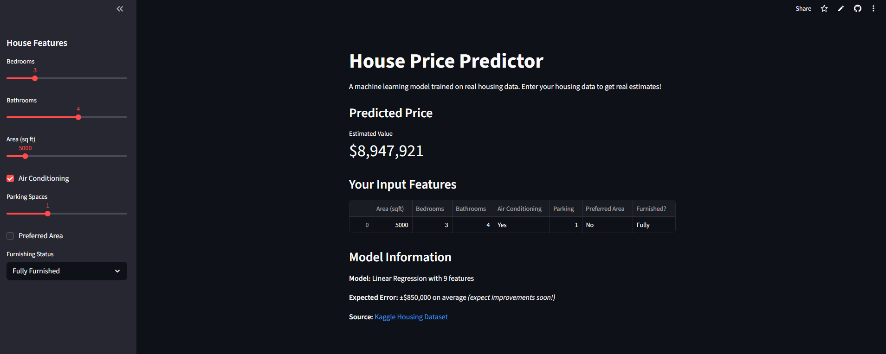

# 🏠 House Price Predictor

An interactive machine learning application that predicts house prices based on real estate features. Built with Streamlit and trained on 545 houses from the Kaggle Housing dataset.

## Demo

**[🚀 Live App on Streamlit Cloud](https://house-price-predictor-7ge62jlm4m3awhc4py5cz8.streamlit.app/)**

Try it now! Adjust the sliders to get instant price predictions.

### Dashboard Screenshot



## Overview

This project demonstrates a complete ML workflow:
1. **Data Cleaning** - Processing raw CSV data with pandas
2. **Model Training** - Linear Regression on 80/20 train-test split
3. **Interactive Predictions** - Streamlit app for real-time price estimates
4. **Deployment Ready** - Modular structure for easy deployment

## Model Performance

| Metric | Value |
|--------|-------|
| **R² Score** | 0.62 (explains 62% of price variation) |
| **MAE** | $849,547 (average prediction error) |
| **RMSE** | $1,144,869 (considering larger errors) |
| **Training Set** | 436 houses |
| **Test Set** | 109 houses |

### Expected Accuracy

For any prediction, expect ±$850,000 error margin on average. The model works best for typical mid-range properties and performs less reliably on luxury properties or outliers.

## Features Used

- **Area** - Square footage of the property
- **Bedrooms** - Number of bedrooms
- **Bathrooms** - Number of bathrooms
- **Air Conditioning** - Yes/No
- **Parking** - Number of parking spaces
- **Preferred Area** - Located in preferred neighborhood (Yes/No)
- **Furnishing Status** - Fully Furnished, Semi-Furnished, or Unfurnished

## Algorithm Selection

### Why Linear Regression?

Initially, I experimented with **Random Forest** to improve predictions. However:

| Model | R² Score | MAE | RMSE |
|-------|----------|-----|------|
| **Linear Regression** | 0.6247 | $849,547 | $1,144,869 |
| **Random Forest (100 trees)** | 0.5843 | $1,063,624 | $1,449,469 |

**Random Forest underperformed because:**
1. **Limited dataset** - 545 samples is too small for tree-based models (need 1000+)
2. **Linear relationships** - Housing prices follow relatively linear patterns with these features
3. **Overfitting risk** - Random Forest with limited data tends to memorize training patterns

**Decision:** Linear Regression was superior and simpler for this dataset.

## Project Structure

```
house-price-predictor/
├── app.py              # Streamlit interactive interface
├── train_model.py      # Model training & evaluation script
├── clean_data.py       # Data cleaning & preprocessing
├── model.pkl           # Trained model (binary)
├── Housing.csv         # Raw dataset
├── Housing_cleaned.csv # Processed dataset
├── requirements.txt    # Python dependencies
└── README.md          # This file
```

## Installation

### Prerequisites
- Python 3.8+
- pip

### Setup

```bash
# Clone repository
git clone https://github.com/yourusername/house-price-predictor.git
cd house-price-predictor

# Create virtual environment
python -m venv venv
source venv/bin/activate  # On Windows: venv\Scripts\activate

# Install dependencies
pip install -r requirements.txt
```

## Usage

### 1. Clean the Data
```bash
python clean_data.py
```
Outputs: `Housing_cleaned.csv`

### 2. Train the Model
```bash
python train_model.py
```
Outputs: `model.pkl` with performance metrics

### 3. Run the App
```bash
streamlit run app.py
```
Opens interactive predictor at `http://localhost:8501`

## How It Works

1. User adjusts sliders/checkboxes for house features in the sidebar
2. Input is converted to proper format (categorical → numeric)
3. Model predicts price based on Linear Regression coefficients
4. Prediction and input features are displayed

### Example Prediction Flow
```
Input: 5000 sqft, 3 bed, 2 bath, AC=Yes, 1 parking, Preferred Area, Semi-Furnished
↓
Model applies learned coefficients
↓
Output: $4,250,000 ± $850,000
```

## Data Source

Dataset: [Kaggle Housing Prices Dataset](https://www.kaggle.com/datasets/yasserh/housing-prices-dataset)
- 545 samples
- 13 features
- Real housing market data (Lahore, Pakistan)

## Files Explained

### `app.py`
- Streamlit UI
- Loads pre-trained `model.pkl`
- No training happens - just prediction inference

### `train_model.py`
- Loads `Housing_cleaned.csv`
- Splits: 80% training, 20% testing
- Trains Linear Regression
- Saves model to `model.pkl`
- Displays performance metrics

### `clean_data.py`
- Reads raw `Housing.csv`
- Selects 8 most relevant features
- Converts categorical data (yes/no → 1/0)
- One-hot encodes furnishing status
- Saves as `Housing_cleaned.csv`

## Model Coefficients

Feature impacts on price (higher = more impact):
- **Area**: +$1,284 per sqft
- **Bedrooms**: +$156,431 per room
- **Air Conditioning**: +$482,625 if present
- **Preferred Area**: +$456,822 if yes
- *See `train_model.py` output for complete list*

## Limitations & Future Work

### Current Limitations
- ±$850k error margin (suitable for general estimates only)
- Limited to dataset range (500-33,000 sqft)
- Assumes linear relationships
- Small training set

### Future Improvements
- [ ] Collect more data (1000+ samples)
- [ ] Try XGBoost with larger dataset
- [ ] Add location-based features
- [ ] Include temporal data (market trends)
- [ ] Model ensembling (Linear + Tree models)
- [ ] Feature engineering (price/sqft ratio)
- [ ] Cross-validation for robustness

## Technologies Used

- **Python 3.13** - Core language
- **Streamlit** - Interactive web interface
- **Scikit-learn** - Machine learning
- **Pandas** - Data manipulation
- **NumPy** - Numerical computing

## Performance Notes

- **Training time**: < 1 second
- **Prediction time**: < 1ms
- **App load time**: ~2 seconds (model cached)
- **File size**: model.pkl = 2KB

## Contributing

This is a portfolio project. Suggestions welcome via issues!

## License

MIT License - feel free to use for learning purposes

## Author

[Your Name]
- GitHub: [@yourusername](https://github.com/yourusername)
- Portfolio: [Your Website]

---

**Last Updated**: February 2026
**Model Version**: 1.0 (Linear Regression)
